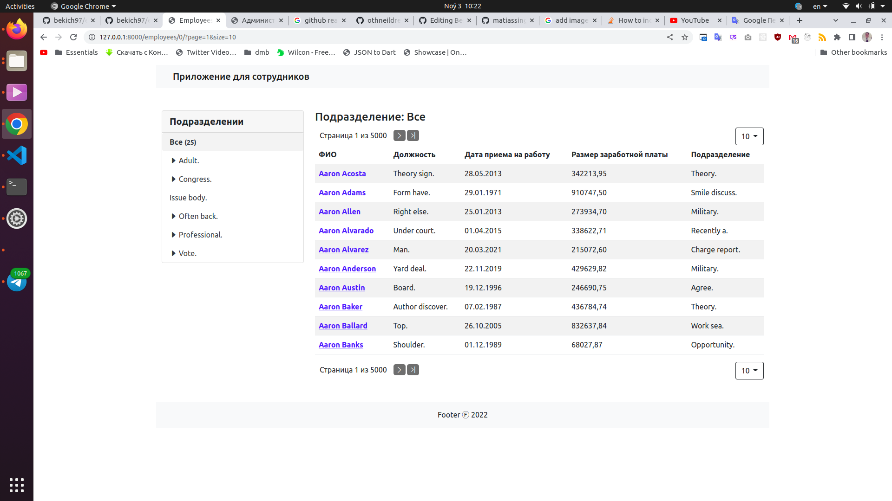
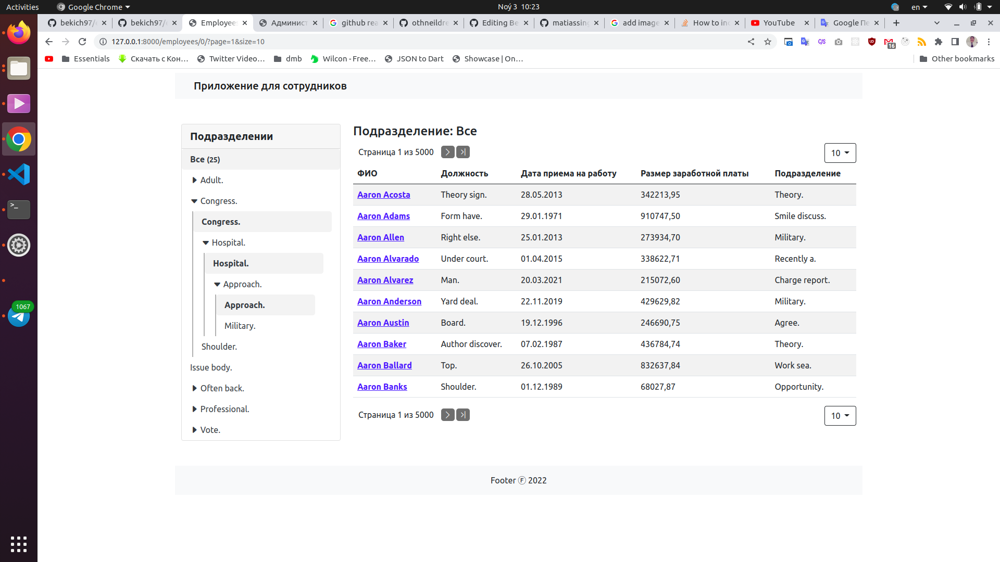
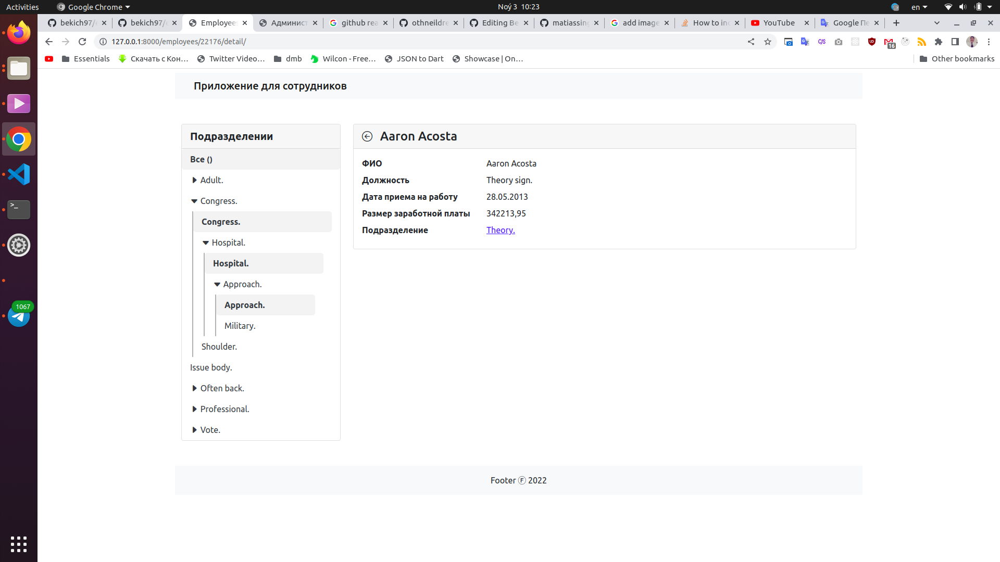
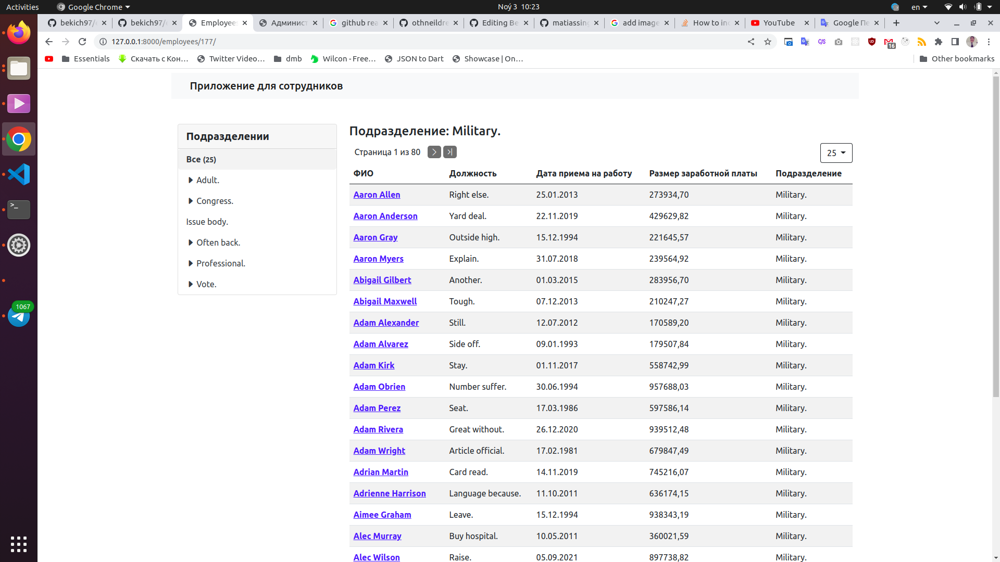
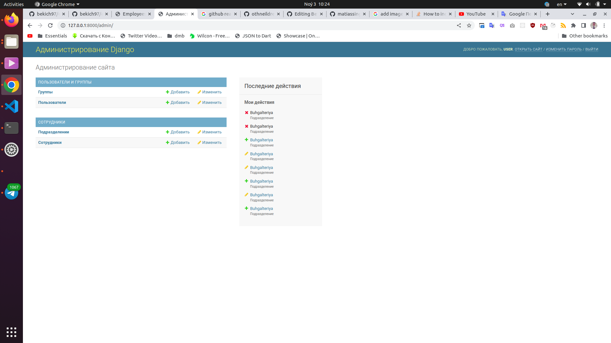
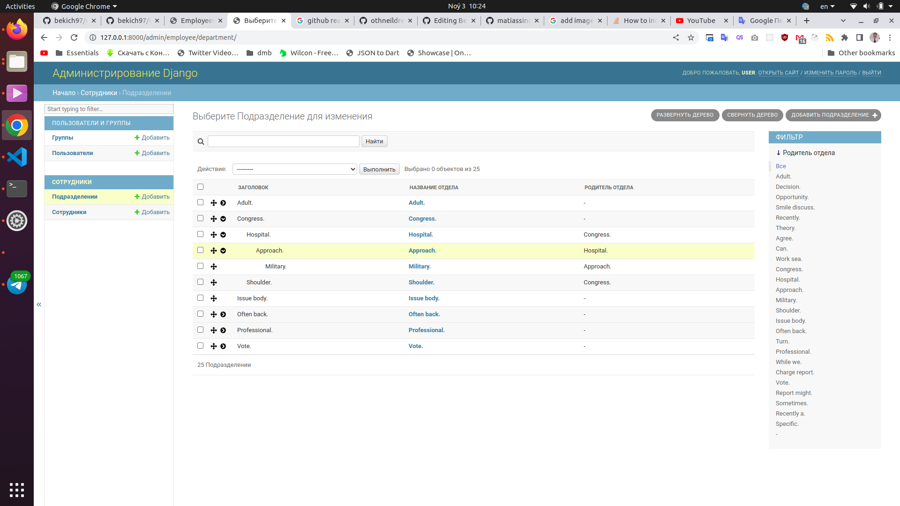
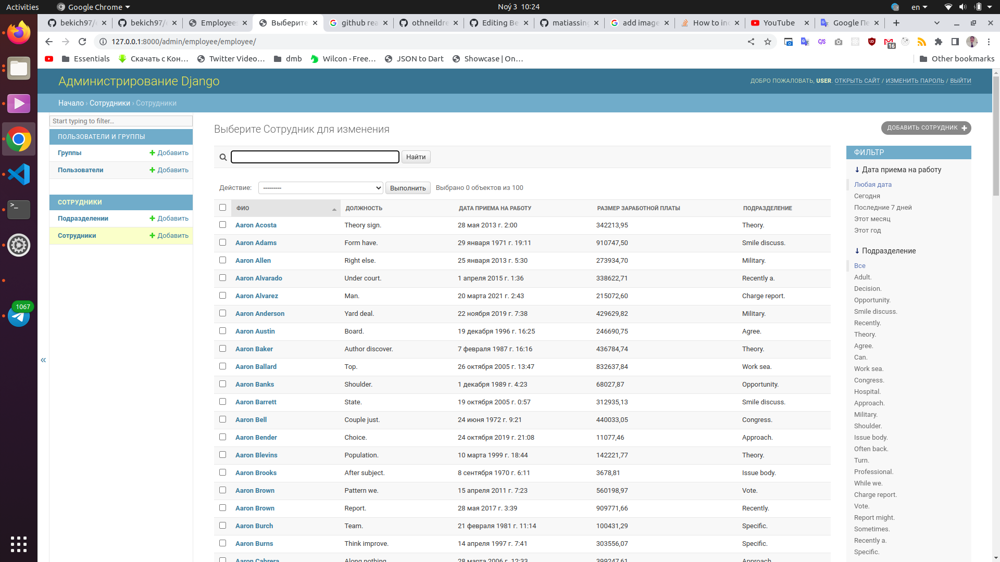
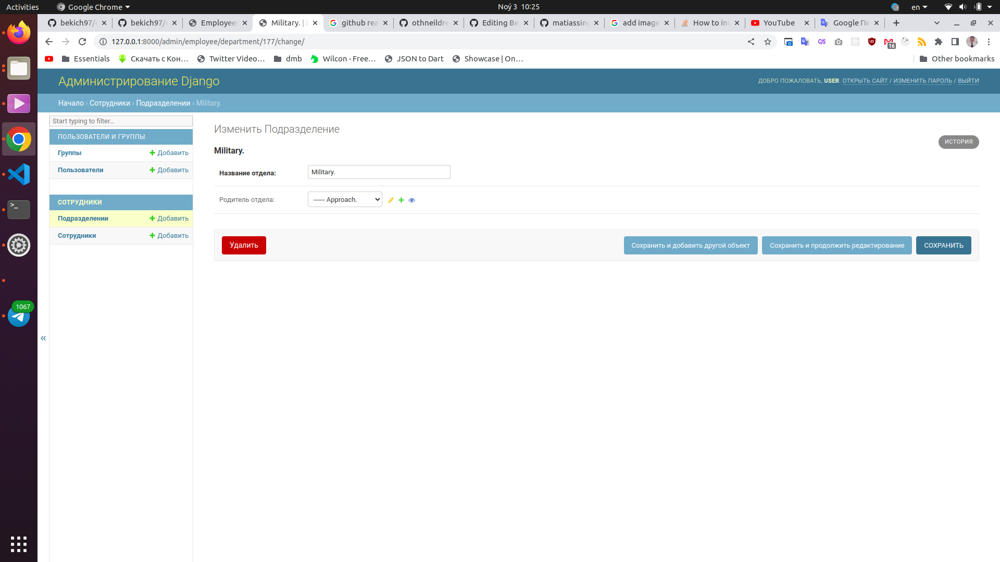
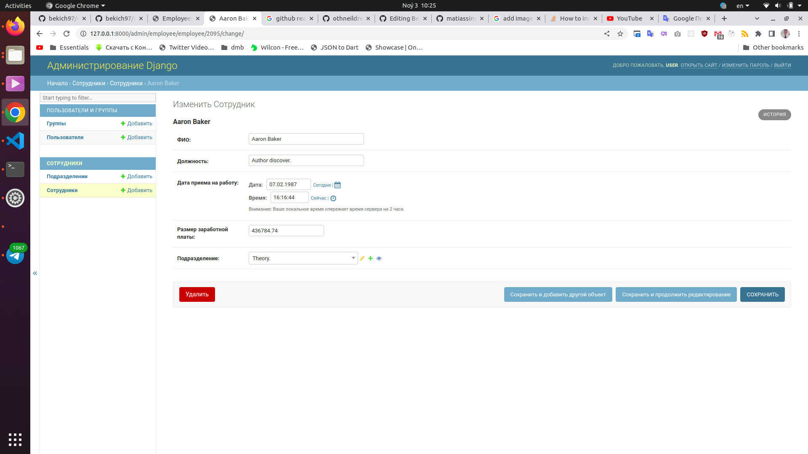

# Employees App

Employees app with Nested Departments


<!-- GETTING STARTED -->
## Getting Started

This is an example of how you may give instructions on setting up your project locally.
To get a local copy up and running follow these simple example steps.

### Prerequisites

* python3.8+
* Django==4.1
* django-mptt==0.14.0
* factory-boy==3.2.1
* flake8==5.0.4

### Installation

1. Clone the repo
   ```sh
   git clone https://github.com/bekich97/employees.git
   ```
2. Create virtual environment with:
   ```sh
   virtualenv venv
   ```
3. Select virtualenv which you created recently, with (in Ubuntu)
   ```sh
   source venv/bin/activate
   ```
4. Install  packages
   ```sh
   pip install -r requirements.txt
   ```
5. Run server
   ```sh
   python manage.py runserver 8000
   ```

Admin panel: ```http://127.0.0.1:8000/admin```

Login username: user

Login password: 121212

## Screenshots

### Client






### Admin





